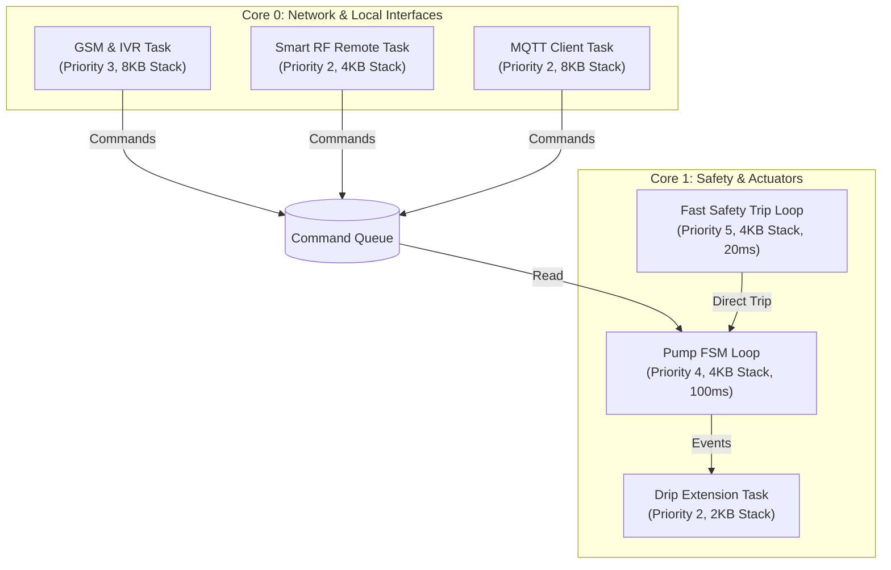
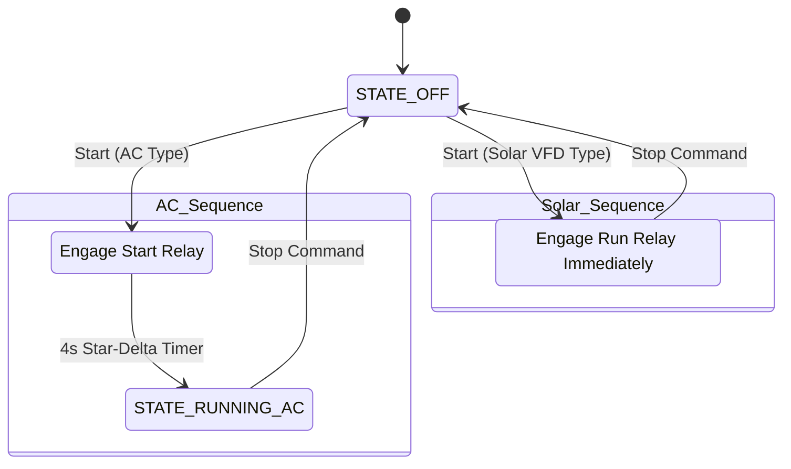

# System Architecture: Version 1.0 Commercial Edition

This document details the software architecture, state machines, task models, and extension hooks for the Version 1.0 Commercial Edition Smart Agricultural Motor Controller.

---

## 1. System Task Model & Core Layout

The ESP32 manages high-speed safety checks, digital communication, and peripheral interfaces. Core tasks are allocated via **FreeRTOS** to guarantee responsive safety bounds.



---

## 2. Solar Pump VFD Integration

Solar pumps rely on Variable Frequency Drives (VFDs) which convert DC solar power to variable AC. Traditional AC safety checks (Phase reversal, single phasing, over/under voltage) must be bypassed when in **Solar VFD Mode**.



### Tripping & Control Adjustments:
* **Star-Delta Bypass**: In Solar VFD mode, the start sequence initiates the running relay immediately, avoiding the 4-second Star-Delta transition.
* **AC Safety Override**: High-voltage AC phase calculations are disabled. Instead, fault states are monitored by connecting the VFD's fault out dry-contact relay to `PIN_FLOAT_LOW` (or dedicated VFD GPIO).

---

## 3. Smart Display RF Remote Communication

Communication between the handheld remote and the base controller occurs at 433MHz GFSK over CC1101 transceivers.

### 3.1 Packet Frame Format
A packed, fixed-length frame of **11 bytes** is transmitted to prevent packet splitting:

| Byte Offset | Field Name | Type | Description |
| :--- | :--- | :--- | :--- |
| `0` | `sync_byte` | `uint8_t` | Constant start indicator `0xAA` |
| `1-4` | `remote_id` | `uint32_t` | Unique 32-bit hardware identifier |
| `5` | `cmd_state` | `uint8_t` | Commands: `START=1`, `STOP=2`, `STATUS=3`, `PAIR=4` |
| `6` | `water_level` | `uint8_t` | Current level percent (0-100%) |
| `7` | `battery_level` | `uint8_t` | Remote battery level percent (0-100%) |
| `8` | `power_available` | `uint8_t` | AC grid presence: `1 = Available`, `0 = Outage` |
| `9` | `motor_state` | `uint8_t` | Controller status: `0 = OFF`, `1 = RUNNING`, `2 = FAULT` |
| `10` | `checksum` | `uint8_t` | XOR checksum of bytes 0 to 9 |

### 3.2 Pairing Protocol
1. **Pair Request**: Remote broadcasts `RF_CMD_PAIR` containing its `UNIQUE_REMOTE_ID`.
2. **Latch State**: If the controller's `paired_remote_id` is empty (`0`), it writes the remote's ID to NVS flash memory.
3. **Acknowledge**: Controller transmits `RF_CMD_PAIR_ACK` containing the same ID to lock the pairing link.

---

## 4. Drip Irrigation Extensions (Event Hook Registry)

To allow future drip irrigation controllers (e.g. fertilizer injection, solenoid manifolds) to integrate without editing core firmware code, we implement a **Modular Event Register**:

```cpp
enum DripEvent {
    DRIP_EVENT_START,
    DRIP_EVENT_STOP,
    DRIP_EVENT_TICK
};

typedef void (*DripCallback)(DripEvent event, const SystemTelemetry &telemetry);
```

* **Integration Point**: Any secondary file can register a callback via `registerDripCallback(cb)`. When FSM states transition, the core calls `notifyDripExtension(event, telemetry)`.

---

## 5. OTA Firmware Update Architecture

OTA updates occur securely using an Active/Passive dual-partition scheme:

```text
    [ ESP32 Flash Partitions ]
    ┌──────────────────────┐
    │  Factory Partition   │ ──► Fallback Boot
    ├──────────────────────┤
    │  App 0 (OTA Active)  │ ◄── Current Running Firmware
    ├──────────────────────┤
    │  App 1 (OTA Passive) │ ◄── Written during OTA Download
    └──────────────────────┘
```

1. **4G GPRS Failover**: If WiFi is unavailable, the SIM7600 is configured to fetch the binary in **1024-byte chunks** using `AT+HTTPREAD=offset,length` parameters. Each chunk is verified and written to passive flash via `Update.write()`.
2. **Rollback**: If the written binary fails validation or the system crashes on first boot, the bootloader automatically reverts to the active app partition.
 